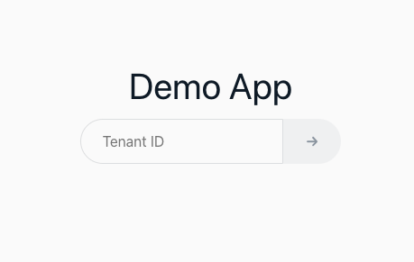

# デプロイ方法

デモのデプロイにあたり、下記のツールの最新バージョンが必要となります。未インストールの場合は事前にインストールをお願いします。
* AWS CLI
* AWS CDK CLI
* Docker

各種リソースを AWS CDK を用いて作成します。最新の AWS CDK をまだインストールされていない場合は[こちら](https://docs.aws.amazon.com/ja_jp/cdk/v2/guide/cli.html)の手順に従ってインストールします。また、以前に AWS CDK でのデプロイのためのリソースをプロビジョンしていない場合は、以下のコマンドでブートストラップを行います。`<YOUR_REGION>` にはデプロイ先のリージョンを指定しください（例：ap-northeast-1）。
```
ACCOUNT=`aws sts get-caller-identity --query 'Account' --output text`
REGION="<YOUR_REGION>"

cdk bootstrap aws://$ACCOUNT/$REGION
```

準備が整ったら、以下のコマンドを実行し、デプロイします。

```bash
cd cdk
npm i
cdk deploy
```

完了したら、以下のコマンドで出力された URL に接続すると、ログイン画面が表示されます。
```bash
aws cloudformation describe-stacks --stack-name SaaSAuthDemoStack --output text --query "Stacks[*].Outputs[?OutputKey=='URL'].OutputValue"
```





以上で、アプリケーションのデプロイは完了です。