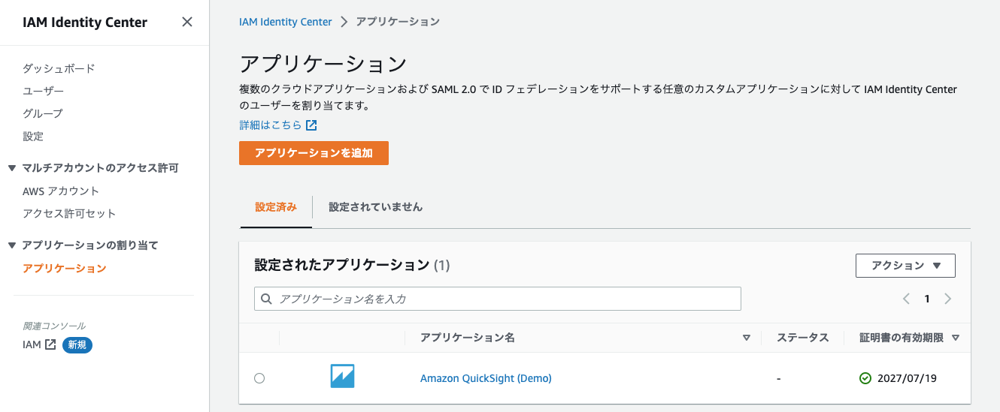
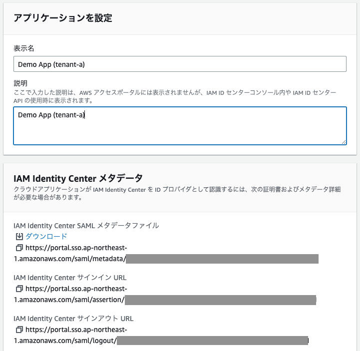
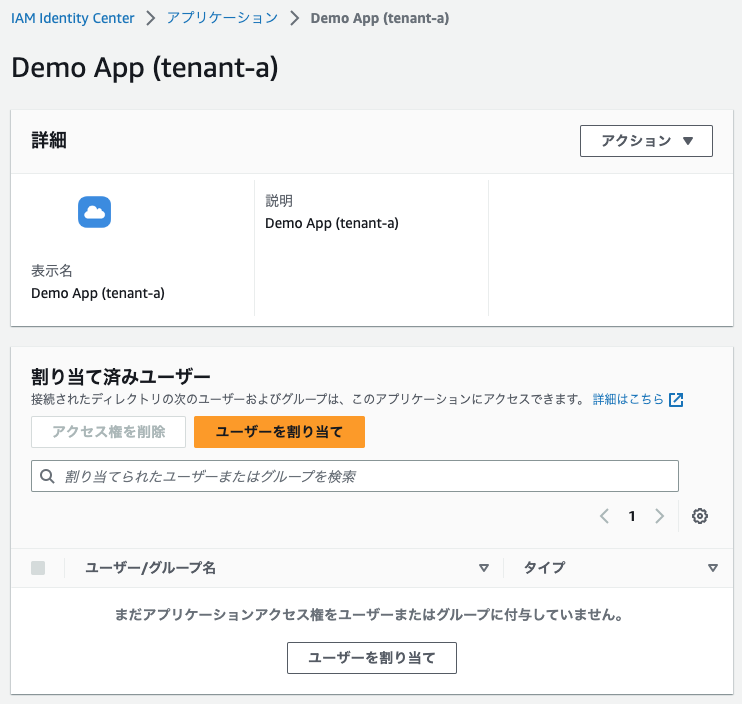
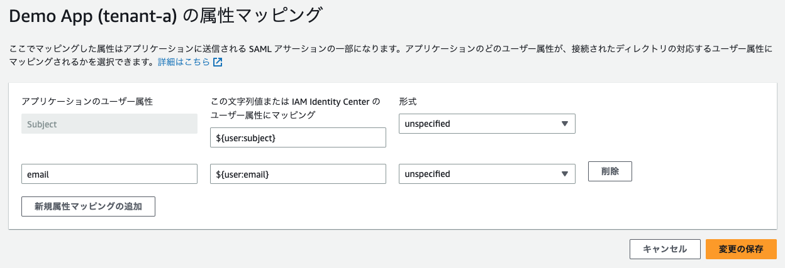
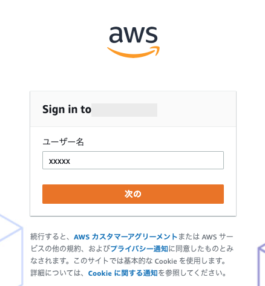
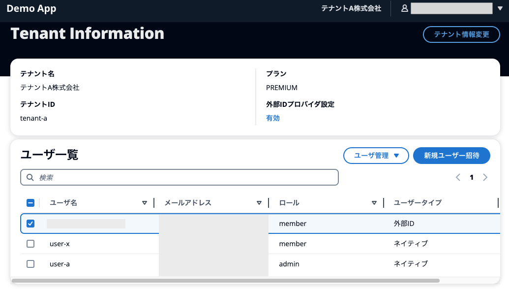

# テナントおよびユーザーの管理

`admin` ロールの `user-a` ユーザーとして[サインイン](sign-in.md)したのち、アプリケーションからユーザーおよびテナントを管理します。

## 1. ユーザーのプロフィールの確認と更新

最初にログインすると、ユーザーのプロフィール画面に遷移します。ここでは、ユーザーの属性やトークンの値が表示されます。

このうち、ユーザーロールはテナント内での権限を示します。`admin` ユーザーはテナントの管理権限をもち、`member` ユーザーはテナント内の参照権限のみを持ちます。詳細なアクセス制御は[こちら](/docs//authorize.md#1-lambda-authorizer-の呼び出し)をご覧ください。

[プロフィール変更] からユーザーの表示名を変更すると、アプリケーションの `/api/{userId}/profile` に対して `PUT` リクエストを送ります。この時、`Authorization` ヘッダーには Cognito から払い出された ID トークンを指定します。画面上の ID トークンをコピーして、このリクエストを CLI や [Postman](https://www.postman.com/) 等で試していただくことも可能です。

## 2. テナント情報の確認と更新

画面右上のテナント名をクリックすると、テナント管理画面に遷移します。

[テナント情報更新] からはテナント名および Tier を変更できます。テナントの Tier は ID Token のクレームに含まれていますが、変更後、再度サインインする、もしくはトークンをリフレッシュするまでトークンには反映されません。

ユーザ一覧のパネルからは新規のユーザーを招待したり、既存のユーザーのロールを変更することができます。`tenant-a` でアクセスした場合、`tenant-a` のユーザーのみを閲覧、管理できるように[アクセス制御](/docs//authorize.md#3-lambda-authorizer-の出力の利用)が行われています。

ここで、`member` ロールでの動作も確認します。`member` ロールを持つユーザーを新たに招待します。`user-a` からログアウトし、新たに招待したユーザーでログインし、同様に新規ユーザーの招待やユーザーの削除を試みます。前述の通り、`member` ユーザーにはテナント内部のユーザーの操作権限がない旨のエラーが表示されます。

## 3. フェデレーションによるサインイン

### 3.1 外部 IdP の設定

`tenant-a` の外部 IdP として IAM Identity Center を利用し、SAML を用いて接続します。

この手順はすでに AWS IAM Identity Center がセットアップ済みであり、ユーザーとグループが作成されていることを前提としています。未設定の場合、[こちら](https://aws.amazon.com/jp/premiumsupport/knowledge-center/assign-user-access-aws-sso/)をご参照いただき、必要に応じてセットアップしてください。

まず、`tenant-a` の `admin` ユーザーとしてサインインし、テナント管理画面に遷移します。次に、[外部IDプロバイダ設定] の [無効] をクリックし、IDプロバイダ管理画面に移ります。その後、右上の [新規IDプロバイダ登録] をクリックします。

続いて、別のウィンドウで AWS IAM Identity Center の画面にアクセスし、左側メニューから*アプリケーション*を選択し、*アプリケーションを追加*をクリックします。

続いて、カスタム SAML 2.0 アプリケーションの追加をクリックし、次を押下します。

アプリケーションの表示名および説明に任意の名前をつけます。画面中央部の IAM Identity Center SAML メタデータファイルの URL をコピーします。デモアプリケーション側の `メタデータ` 蘭で [メタデータURLを指定] にチェックが入っていることを確認し、下のテキストボックスにコピーした SAML メタデータファイルの URL を入力します。

IAM Identity Center のウィンドウに戻り、最下層の `アプリケーションメタデータ` で [メタデータ値をマニュアルで入力する] が選択されていることを確認します。

[Amazon Cognito のドキュメント](https://docs.aws.amazon.com/ja_jp/cognito/latest/developerguide/cognito-user-pools-saml-idp.html)に従い、**アプリケーション ACS URL** には `https://<UserPool Domain>/saml2/idpresponse` を、**アプリケーション SAML 対象者 (SAML audience)** に `urn:amazon:cognito:sp:<UserPool ID>` を入力します。

これらの値はデモアプリケーションの画面上に `ACS URL`、`アプリケーション URN` として表示されているため、コピーして IAM Identity Center の画面に貼り付けます。

上記が問題なければ IAM Identity Center の画面上で [送信] を押して SAML 接続先のアプリケーションを作成します。同時に、デモアプリケーション上でも [登録] を押下し、IAM Identity Center を`tenant-a` の外部 IdP として登録します。これにより、IdP である IAM Identity Center とサービスプロバイダーである Cognito ユーザープールの間で信頼関係を構築できました。

続いて、IdP である IAM Identity Center から SP である Amazon Cognito に連携する属性を指定します。画面右上の [アクション] から **属性マッピングを編集** をクリックし、以下の値を入力します。

|アプリケーションのユーザー属性|マッピング|形式|
|-|-|-|
|Subject|${user:subject}|unspecified|
|email|${user:email}|unspecified|

ここでは、IdP 上で一意に特定する値の他にユーザーの email アドレスを渡しています。このとき、IAM Identity Center 側の`アプリケーションのユーザー属性`とデモアプリケーション側の `email属性マッピング` で同じ `email` という属性名が指定されていることを確認します。この値はユーザープール上の `custom:emailFromIdp` カスタム属性にマッピングされます。

最後に、**ユーザーを割り当て**をクリックし、作成したアプリケーションにフェデレーションサインインさせたいユーザーを割り当てます。この後の手順ではアプリケーションを割り当てたユーザーでログインします。以上で、IAM Identity Center 側の設定は完了です。

### 3.2. 外部 IdP を用いたユーザーのサインイン

デモアプリケーションにて、右上の [user-a] メニューを開いて [ログアウト] をクリックします。
ログアウトが成功すると、再度 `tenant-a` のサインインページが表示されます。この時、画面下部に [外部 ID でログイン] というボタンが追加されていることを確認します。このボタンをクリックすると、Cognito の OIDC Endpoint 経由で先ほど設定した IAM Identity Center のサインイン画面に遷移します。

ここで、先ほど**ユーザーを割り当て**で選択したユーザーのユーザー名とパスワードを入力して AWS IAM Identity Center にサインインします。認証が成功すると、アプリケーションの画面に再度リダイレクトされます。
正常にサインイン後画面が表示されたのち、テナント管理画面に遷移し、`ユーザータイプ : 外部ID` のユーザーが新たに作成されていることを確認します。

フェデレーションサインインの技術的な詳細は[こちら](/docs/federation-signin.md)をご確認ください。