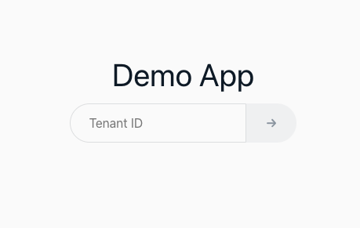
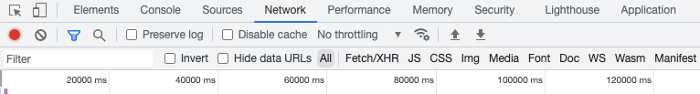
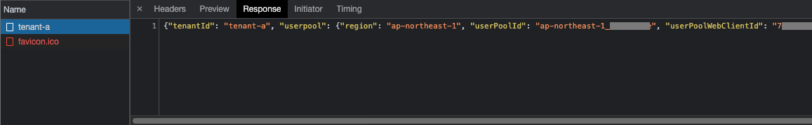
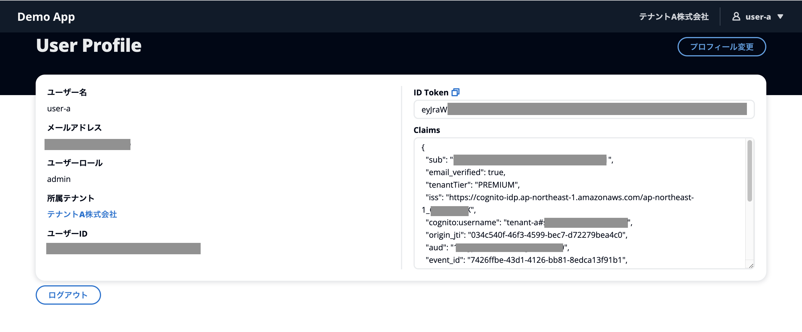

# テナントへのサインイン

[オンボーディング](onboarding.md)処理にてテナントとユーザーを作成したため、そちらにサインインします。

## 1. サインイン画面へのアクセス
[デプロイ方法](how-to-deploy.md)の手順で出力された URL にアクセスし、下記のサインインフォームが表示されることを確認します。



## 2. テナント ID の入力

下記の手順はGoogle Chrome でのデモを想定しております。必要に応じてブラウザごとに読み替えをお願いします。

このタイミングで開発者ツールの Network タブを開いておきます。




フォームに `tenant-a` と入力し、[Enter] を押下します。

## 3. サインイン

テナントの専用サインインページである `/login/tenant-a` に遷移します。
ここで開発者ツールを確認すると、バックエンドアプリの `/api/authconfig/tenant-a` エンドポイントにアクセスしていることが確認できます。



レスポンスにはテナントごとのアプリクライアント ID が含まれており、この値を使って Amplify ライブラリのセットアップをしています。

[Login.tsx](/web/src/page/Login.tsx#L43)
```tsx
...
    getAuthConfig(tenantId).then((authConfig)=> {
      Auth.configure(authConfig.userpool);
      localStorage.setItem(`authConfig-cache.${tenantId}`, JSON.stringify(authConfig));
      setAuthConfig(authConfig);
      setIsReady(true);
    })
...
```

サインイン用のフォームには Amplify UI Components を利用しています。これにより Cognito API との詳細なやりとりをライブラリ側に任せることができます。

[Login.tsx](/web/src/page/Login.tsx#L88)
```html
  <Authenticator hideSignUp={true} components={components} services={services}>
    ...
  </Authenticator>
```

先ほど作成したユーザーのメールアドレス宛に上記ページへのリンクと一時パスワードが届きます。リンクをクリックし、テナントごとのログインページに再度接続した上で一時パスワードを入力し、サインインします。パスワードの変更が要求されますので、任意のパスワードに変更します。

なお、[オンボーディング](/docs/onboarding.md)でも触れた通り、ユーザープール上のユーザー名は各ユーザー`<tenantId>#<email>`として作成されています。
これをユーザーに意識させないために以下のようにフォーム上でサインイン時の処理をフックしています。

```typescript
  ...
  const services = {
    async handleSignIn({username, password}: {username: string, password: string}) {
      return await Auth.signIn(`${tenantId}#${username}`, password);
    },
    async handleForgotPassword(username: string) {
      return await Auth.forgotPassword(`${tenantId}#${username}`);
    },
    async handleForgotPasswordSubmit({username, code, password}: {username: string, code: string, password: string}) {
      return await Auth.forgotPasswordSubmit(`${tenantId}#${username}`, code, password);
    }
  };
  ...
```

## 4. サインイン後画面

サインインが完了すると、Amazon Cognito によって発行された ID トークンの中身が表示されます。



`Claims` を見ると `aud` にテナント用のアプリケーションクライアント ID が設定されていることがわかります。
加えて、 DynamoDB テーブルに登録された以下の値が Cognito の[トークン生成前の Lambda トリガー](/cdk/functions/cognito-pre-token-generation/index.ts)によって下記のように付与されていることが確認できます。

| クレーム名	| 説明 |
|-|-|
| tenantId | ユーザーがサインインしたテナントを表す識別子。 |
| tenantTier | ユーザーのサインイン先のテナントの契約プラン。テナントの契約プランによってアクセス制御を行いたい場合は JWT 内部のこのクレームを参照してアクセス制御を行う。 |
| userRole | ユーザーのテナント内での役割。管理者ユーザーか、一般ユーザーかを示す。テナント内の役割によってアクセス制御を行いたい場合は JWT 内部のこのクレームを参照してアクセス制御を行う。 |

Cognito 単体でもカスタム属性を用いることでこれらの値をユーザーに紐づけて管理することは可能です。
ただし、userRole や tenantTier のように頻繁に変更され得る値やテナントに紐づく値を Cognito に保存する選択をする場合、
[参照時、更新時のリクエストクォータ](https://docs.aws.amazon.com/ja_jp/cognito/latest/developerguide/limits.html)を十分に検討する必要があります。

同じユーザープールでアプリケーションクライアントを用いてテナントを分ける場合、どのユーザーがどのアプリケーションクライアントを用いてログインすることが許可されているかを管理することも必要です。
本デモアプリケーションの`トークン生成前の Lambda トリガー`ではログインに用いられたユーザープール ID、アプリケーションクライアント ID を元にテナントを特定し、
ユーザーと紐付けがされていない場合、エラーを返します。これにより、ユーザーが意図しないテナントでログインすることを防いでいます。

## 5. 別テナントでのサインイン

画面最下部のボタンからログアウトし、今度は `tenant-b` と入力して [Enter] を押下します。
先ほど作成した `user-b` としてサインインすると、テナントB、`user-b` の属性が ID トークンの `Claims` に反映されていることが確認できます。

